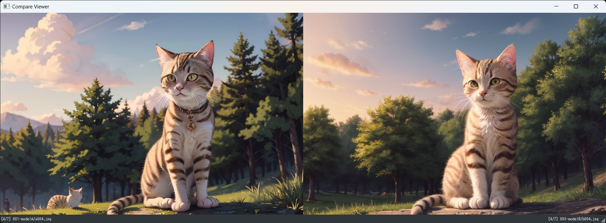
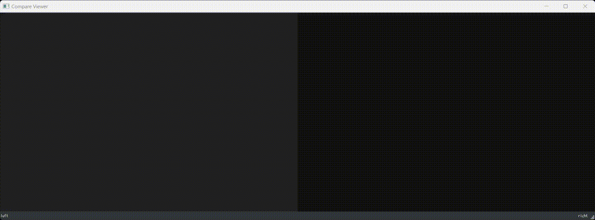

## About CompareViewer 0.1.3
CompareViewer is a tool to compare two images and preview them side by side.  
This tool is designed to compare images created with StableDiffusion, such as Prompt, Model, Lora, Seed, and Strength, side by side.  
It works with mouse or keyboard.  
Supports jpg, png, webp files  

## Features
- Sequential preview of images in the same hierarchy with two images side by side  
- Swap left and right images only while pressing down key or right mouse button, so that you can see the change points of the left and right images.  
- Can also be used to find mistakes between two images.  

## How to install (simple)
[Download the simple installation zip]  
https://github.com/nekotodance/CompareViewer/releases/download/latest/CompareViewer.zip

- Python installation (SD standard 3.10.6 recommended)  
- Extract the zip file  
- Right-click “CompareViewer-install.ps1” in the extracted folder and select “Run with PowerShell
- At the end of the install, it will ask if you want to copy the link to your desktop  
At the end of the install, it will ask if you want to copy the shortcut to your desktop.  
Type “y” if you want to, or just press “enter”.  
If not, type “n” and press “enter  
- A CompareViewer link will be created.

Double-click the link file to start it.

## How to install (manually)
- Python installation (SD standard 3.10.6 recommended)  
- Install git  
- Get repository with git  
    git clone https://github.com/nekotodance/CompareViewer
- Required libraries  
    pip install PyQt5 Image
- How to run  
    Python CompareViewer.py

## How to use
Drag and drop an image file or a folder containing image files onto the application.  
(If you drag and drop two images at the same time, they will be displayed on the left and right sides of the screen.  
You can also drag and drop only one image to the left or right part of the screen.  

#### Key operations (if you want to change the assignment, please rewrite the key event processing in the source as you like)
AD,LEFT & RIGHT : Move to the previous and next image in the same folder at the same time.  
Q,ESC : Exit  
0,1,2 : Toggle between 0:1/2, 1:Equal, 2:2 times the image size and the currently saved window size (toggle operation)  
Enter : Toggles to full screen display (toggle action)  
S, Down : Switches left and right images only while being pressed.  

#### Mouse operation
Wheel operation : Move left and right simultaneously to the previous and next images in the same folder.  
Right button : Swap left and right images only while holding down the button.  
Drag left : Move the window.  
Left double-click : Switch to full screen (toggle action)  

## Operation image

The video shows the following operation  
- Open the application and drag & drop the two folders “001-modelA” and “003-modelB” *1 in the docs folder.  
- D or right key and mouse wheel to advance to the 4th image  
- Switch the left and right images by pressing S or the down key and check the change point  
- Press D or right key and mouse wheel to go all the way through the folder  

*1: The reference images in the docs folder are image files of the same prompt output with different models

## Notes.
- None in particular.  

## Change history
- 0.1.3 Added control key combination operation, modified readme  
- 0.1.2 Fixed a window resizing bug when displaying only one-sided images, full-screen mode when double-clicking, etc  
- 0.1.1 App icon settings  
- 0.1.0 First version  
