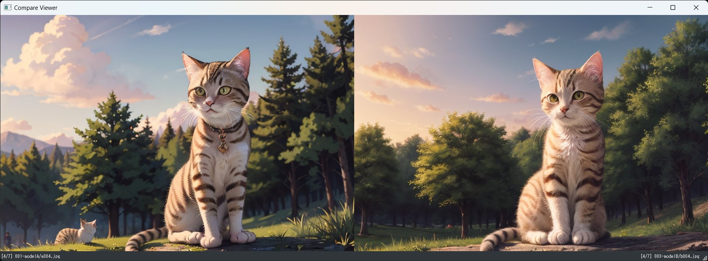

[README in English](readme-en.md)

## CompareViewerについて 0.1.0
２つの画像を比較しながらプレビューするツールです  

StableDiffusionで作成したモデル、Prompt、Prompt強度、Lora、Seed番号違いなどの画像を左右に並べて見比べる事を目的としたツールです  
マウスもしくはキーボードで動作します  
jpg, png, webpファイルの表示をサポートしています  

## 特徴
- 2つの画像を左右に並べたまま同じ階層の画像を順次プレビュー  
- 下キーもしくはマウス右ボタンを押下している間のみ左右の画像を入れ替える事で、左右の画像の変化点を把握  
- 画像２つの間違い探しなどにも利用可能  

## インストール方法（簡易）
[簡易インストール版zipのダウンロード] https://github.com/nekotodance/CompareViewer/releases/download/latest/CompareViewer.zip

- zipファイルを解凍
- 解凍したフォルダ内の「CompareViewer-install.ps1」を右クリックして「PowerShellで実行」を選択
- イントールの最後にデスクトップにリンクをコピーするかどうかを聞いてきます  
「"Do you want to copy the shortcut to your desktop? (y or enter/n)」  
必要があれば「y」入力後、もしくはそのまま「enter」キー  
必要なければ「n」入力後「enter」キー  
- CompareViewerリンクが作成されます

リンクファイルをダブルクリックで起動できます

## インストール方法（手動）
#### 必要なライブラリ
    PyQt5 Image
#### 動作確認
    py CompareViewer.py

## 利用方法
アプリ上に画像ファイル、もしくは画像ファイルが入ったフォルダをドラッグ＆ドロップしてください  
2つ同時にドラッグ＆ドロップした場合には左右に表示されます  
1つだけを左部分や右部分にドラッグ＆ドロップすることも可能です  

#### キー操作（割当を変えたい人はソースのキーイベント処理を好きに書き換えてください）
AD,左右   : 左右同時に同じフォルダ内の前後の画像に移動  
Q,ESC     : 終了  
0,1,2     : 画像サイズの0:1/2、1:等倍、2:2倍と現在保存中ウインドウサイズに切り替え（トグル動作）  
Enter     : 全画面表示に切り替え（トグル動作）  
S,下      : 押している間だけ左右の画像を入れ替え  

#### マウス操作
ホイール操作     : 左右同時に同じフォルダ内の前後の画像に移動  
右ボタン         : 押している間だけ左右の画像を入れ替え  
左ドラッグ       : ウインドウを移動  

## 操作イメージ

動画では以下のような操作を行っています  
- アプリを開きdocsフォルダ内の「001-modelA」と「003-modelB」の２つのフォルダ※1をドラッグ＆ドロップ  
- Dもしくは右キー、マウスホイールで画像の4枚目まで進む  
- Sもしくは下キーで左右の画像を入れ替えて変化点をチェック  
- Dもしくは右キー、マウスホイールでフォルダ内を一巡りするまで進む  

※1:docsフォルダ内の参考画像は同じプロンプトで違うモデルで出力した画像ファイルとなります。

## 注意事項
- 特になし  

## 変更履歴
- 0.1.0 初版  

以上
